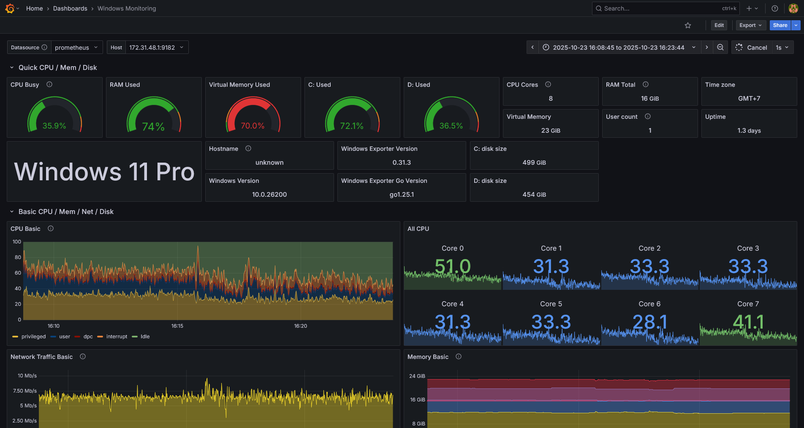

# Grafana and Prometheus

## Windows Exporter
1. Get Windows Exporter installer from [Github Repository](https://github.com/prometheus-community/windows_exporter)
2. Install until complete on Windows
3. Allow firewall inbound TCP to port 9182

### Always setup in linux with docker
1. Add windows exporter information to `prometheus.yml`
2. Run `script.ps1` on windows and `run_grafana.sh` on linux
3. Open grafana and import graphic json from setup directory if this first time to running grafana
4. Now you can see the dashboard like this

